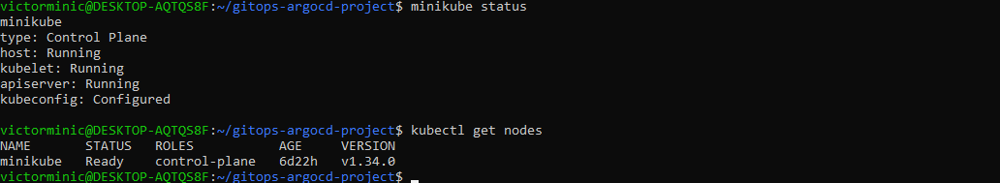
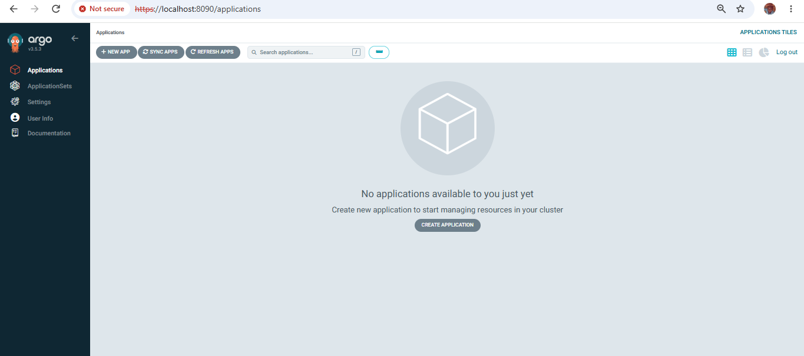
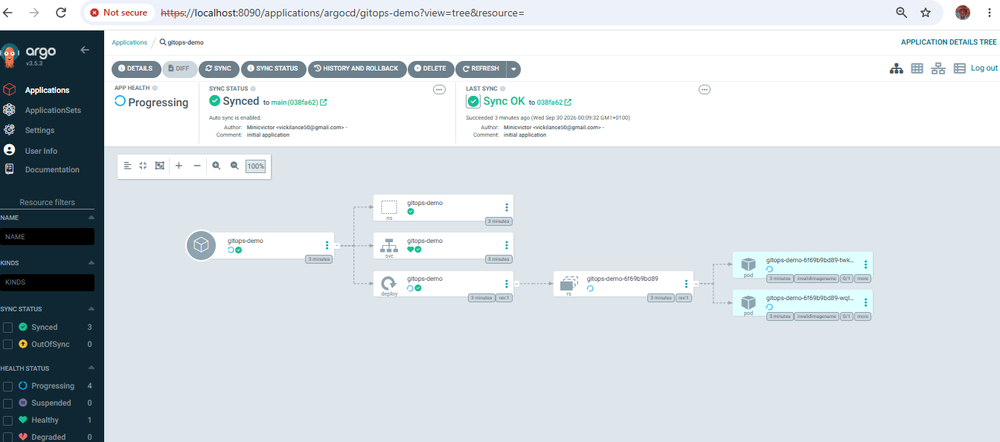
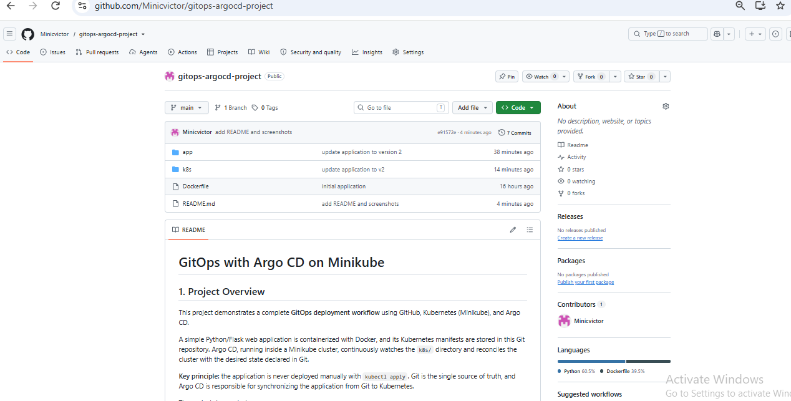
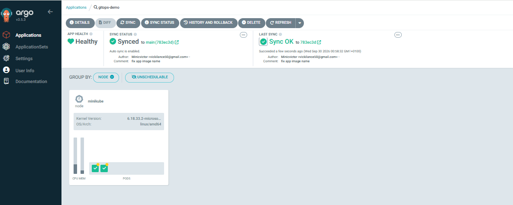
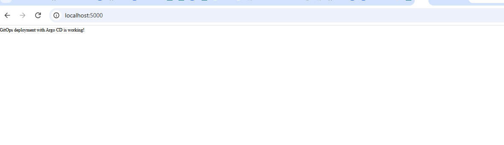
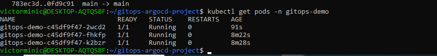
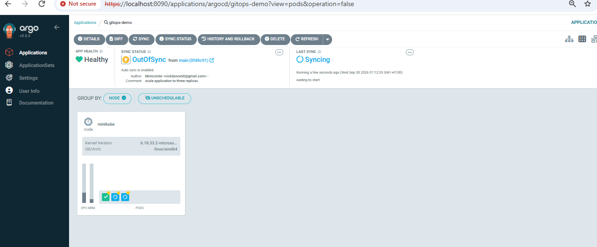
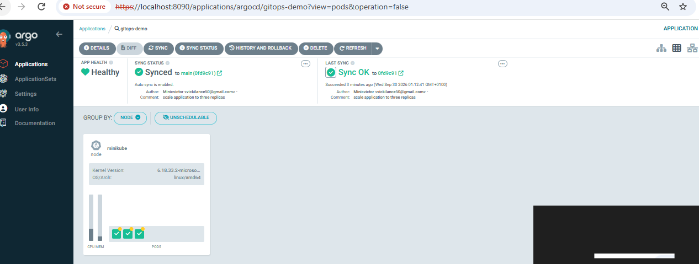
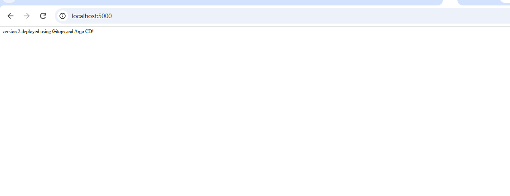

# GitOps with Argo CD on Minikube

## 1. Project Overview

This project demonstrates a complete **GitOps deployment workflow** using GitHub, Kubernetes (Minikube), and Argo CD.

A simple Python/Flask web application is containerized with Docker, and its Kubernetes manifests are stored in this Git repository. Argo CD, running inside a Minikube cluster, continuously watches the `k8s/` directory and reconciles the cluster with the desired state declared in Git.

**Key principle:** the application is never deployed manually with `kubectl apply`. Git is the single source of truth, and Argo CD is responsible for synchronizing the application from Git to Kubernetes.

The project demonstrates:

- Containerizing an application
- Declaring Kubernetes configuration in Git
- Deploying through Argo CD
- Scaling through Git (2 → 3 replicas)
- Detecting and recovering from configuration drift
- Rolling out a new application version through Git

-----

## 2. Architecture

```
Developer
    |
    | git push
    v
  GitHub  (gitops-argocd-project, path: k8s/)
    |
    | desired state
    v
  Argo CD  (namespace: argocd)
    |
    | reconciliation
    v
  Minikube
    |
    v
  Kubernetes  (namespace: gitops-demo)
    |
    v
  Application  (Flask, port 5000)
```

-----

## 3. Technologies Used

|Technology    |Purpose                              |
|--------------|-------------------------------------|
|Git           |Version control                      |
|GitHub        |Remote repository and source of truth|
|Docker        |Containerizing the Flask application |
|Docker Hub    |Container image registry             |
|Kubernetes    |Container orchestration              |
|Minikube      |Local single-node Kubernetes cluster |
|Argo CD       |GitOps continuous delivery controller|
|WSL           |Linux environment on Windows         |
|Python / Flask|Sample web application               |

-----

## 4. Project Structure

```
gitops-argocd-project/
├── app/
│   ├── app.py
│   └── requirements.txt
├── Dockerfile
├── k8s/
│   ├── namespace.yaml
│   ├── deployment.yaml
│   └── service.yaml
├── argocd-app.yaml
├── screenshots/
└── README.md
```

|Path                  |Purpose                                                              |
|----------------------|---------------------------------------------------------------------|
|`app/app.py`          |Flask application with `/` and `/health` endpoints                   |
|`app/requirements.txt`|Python dependencies (Flask)                                          |
|`Dockerfile`          |Builds the container image for the application                       |
|`k8s/namespace.yaml`  |Creates the `gitops-demo` namespace                                  |
|`k8s/deployment.yaml` |Defines the Deployment (replicas, image, labels, port 5000)          |
|`k8s/service.yaml`    |NodePort Service exposing the application on port 5000               |
|`argocd-app.yaml`     |Argo CD Application definition (repo, path, destination, sync policy)|
|`screenshots/`        |Evidence of each stage of the project                                |
|`README.md`           |Project documentation                                                |

-----

## 5. Application Deployment

### 5.1 Containerize

```bash
docker build -t <dockerhub-user>/gitops-demo:1.0 .
docker run -d -p 5000:5000 --name test <dockerhub-user>/gitops-demo:1.0
curl http://localhost:5000
docker rm -f test
docker push <dockerhub-user>/gitops-demo:1.0
```

### 5.2 Start Minikube

```bash
minikube start --driver=docker
minikube status
kubectl get nodes
```

### 5.3 Install Argo CD

```bash
kubectl create namespace argocd
kubectl apply -n argocd -f https://raw.githubusercontent.com/argoproj/argo-cd/stable/manifests/install.yaml
kubectl get pods -n argocd
```

**Verification:** all Argo CD pods (`argocd-server`, `argocd-repo-server`, `argocd-application-controller`, `argocd-redis`, etc.) reached the `Running` state with all containers ready.

### 5.4 Access the Argo CD Dashboard

```bash
kubectl port-forward svc/argocd-server -n argocd 8080:443
kubectl -n argocd get secret argocd-initial-admin-secret \
  -o jsonpath="{.data.password}" | base64 -d
```

The dashboard was opened at `https://localhost:8080` and accessed with the `admin` user and the initial password retrieved from the cluster secret. **No passwords or credentials are stored in this repository.**

### 5.5 Connect Argo CD to GitHub and Create the Application

The Argo CD Application (`argocd-app.yaml`) identifies:

|Setting         |Value                                                     |
|----------------|----------------------------------------------------------|
|Application name|`gitops-demo`                                             |
|Repository      |`https://github.com/minicvictor/gitops-argocd-project.git`|
|Path            |`k8s/`                                                    |
|Destination     |Minikube (`https://kubernetes.default.svc`)               |
|Namespace       |`gitops-demo`                                             |
|Sync policy     |Automated (`prune: true`, `selfHeal: true`)               |

Because the repository is public, no repository credentials were required.

The Application object was registered once with:

```bash
kubectl apply -f argocd-app.yaml
```

This registers **Argo CD’s Application definition only**. The application workload itself (Namespace, Deployment, Service) was created by Argo CD from the manifests in `k8s/`, never by `kubectl apply`.

### 5.6 Verify the Deployment

```bash
kubectl get pods -n gitops-demo
kubectl get deployment -n gitops-demo
kubectl get service -n gitops-demo
minikube service gitops-demo -n gitops-demo --url
```

The application responds with:

```
GitOps deployment with Argo CD is working!
```

-----

## 6. GitOps Workflow

```
Code/Configuration Change
        ↓
      GitHub
        ↓
      Argo CD
        ↓
  Detect Change
        ↓
  Reconciliation
        ↓
    Kubernetes
        ↓
   Application
```

1. A change is committed and pushed to GitHub.
1. Argo CD detects that the repository differs from the live cluster state.
1. With automated sync enabled, Argo CD applies the difference to the cluster.
1. Kubernetes converges to the new desired state and the application updates.

### Scaling through Git (2 → 3 replicas)

`replicas` in `k8s/deployment.yaml` was changed from `2` to `3`, committed, and pushed:

```bash
git commit -am "Scale application to 3 replicas"
git push origin main
```

Argo CD detected the change and synchronized the cluster. The pod count went from **2 → 3** without running `kubectl scale`.

-----

## 7. Configuration Drift

**Experiment:** the live Deployment was modified manually, bypassing Git:

```bash
kubectl scale deployment gitops-demo --replicas=1 -n gitops-demo
```

|Item                      |Value                                                                    |
|--------------------------|-------------------------------------------------------------------------|
|**Desired state** (Git)   |`replicas: 3`                                                            |
|**Actual state** (cluster)|`replicas: 1`                                                            |
|**Argo CD status**        |`OutOfSync` (live state differs from Git)                                |
|**Reconciliation**        |Argo CD re-applied the Git-declared state, scaling the Deployment back up|
|**Final state**           |`replicas: 3`, status `Synced` and `Healthy`                             |

### What is configuration drift?

Configuration drift is when the live state of the system no longer matches the desired state declared in the source of truth (Git).

### Why did the drift occur?

Because the replica count was changed directly on the cluster with `kubectl scale`, without changing `deployment.yaml` in Git. Git still declared 3 replicas while Kubernetes was running 1.

### What state does Argo CD report?

`OutOfSync`. Argo CD compares the live cluster with the manifests in Git and flags the difference on the Deployment resource.

### What happens when Argo CD reconciles the application?

Argo CD re-applies the desired state from Git. Because `selfHeal` is enabled, this happens automatically: the manual change is overwritten and the Deployment is scaled back to 3 replicas.

### What is the final replica count?

**3**, the value declared in Git.

**Takeaway:** in GitOps, changes must be made in Git. Manual changes to the cluster are temporary and get reverted.

-----

## 8. Application Update

The application was updated from Version 1 to Version 2 entirely through Git:

1. In `app/app.py`, the response was changed from
   `GitOps deployment with Argo CD is working!` to
   `Version 2 deployed using GitOps and Argo CD!`
1. A new image was built and pushed:
   
   ```bash
   docker build -t <dockerhub-user>/gitops-demo:2.0 .
   docker push <dockerhub-user>/gitops-demo:2.0
   ```
1. The image tag in `k8s/deployment.yaml` was updated from `1.0` to `2.0`.
1. The changes were committed and pushed:
   
   ```bash
   git commit -am "Update application to version 2"
   git push origin main
   ```
1. Argo CD detected the manifest change and rolled out the new version.

Complete flow:

```
Developer → GitHub → Argo CD → Kubernetes → Application
```

Argo CD watches the manifests, not the image contents, so the image tag was changed in Git to trigger the rollout.

-----

## 9. Argo CD Application Health

Argo CD reports two independent statuses.

### Sync Status

Whether the live cluster matches Git.

|Status     |Meaning in this deployment                                                                                            |
|-----------|----------------------------------------------------------------------------------------------------------------------|
|`Synced`   |The Deployment, Service, and Namespace in the cluster match `k8s/` in Git (for example, 3 replicas live and 3 in Git).|
|`OutOfSync`|The cluster differs from Git (for example, 1 replica live while Git declares 3, or a new commit not yet applied).     |

### Health Status

Whether the deployed resources are working.

|Status       |Meaning in this deployment                                                                                      |
|-------------|----------------------------------------------------------------------------------------------------------------|
|`Healthy`    |All `gitops-demo` pods are running and ready, and the Service has endpoints.                                    |
|`Progressing`|Pods are still being created or updated, such as during scaling or the V1 → V2 rollout.                         |
|`Degraded`   |Something is failing, such as pods in `CrashLoopBackOff` or `ImagePullBackOff` (for example, a wrong image tag).|

An application can be `Synced` but `Degraded` (Git applied correctly but pods crash), or `OutOfSync` but `Healthy` (pods run fine but differ from Git). The two statuses answer different questions.

-----

## 10. Screenshots

### Minikube running



### Argo CD dashboard



### Argo CD Application



### Git repository



### Successful synchronization (Synced / Healthy)



### Application running (Version 1)



### Scaling through Git (3 replicas)



### Configuration drift (OutOfSync)



### Drift recovery (back to Synced)



### Application update (Version 2)



-----

## Restrictions Followed

- The application was **not** deployed with `kubectl apply`. Argo CD synchronizes it from Git.
- The 2 → 3 scaling was done through Git, not `kubectl scale`.
- `kubectl scale` was used **only** to create the drift experiment.
- `kubectl get` was used only for inspection and verification.
- No passwords, tokens, or credentials are stored in this repository.
